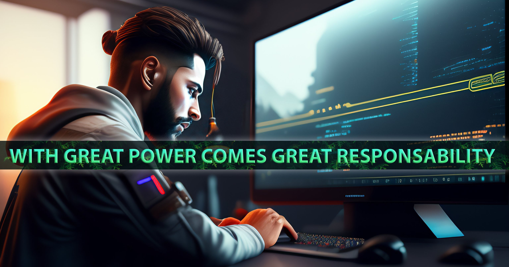

   
##  👋 Hi there!

My name is Georginot Armelin and I enjoy creating things that live on the internet. My interest in web development started back in 2016 
  I'm fullStack <b>Developer from Madagascar</b>

  <small>Here is my <a href="https://raherygino.github.io">Portolio</a></small>  

### Github Stats ⚡
  
  
  
  

<!-- activity graph heroku-app start 

    

activity graph heroku-app end 
<picture>
  <source media="(prefers-color-scheme: dark)" srcset="https://api.star-history.com/svg?repos=tsirysndr/music-player&type=Date&theme=dark" />
  <source media="(prefers-color-scheme: light)" srcset="https://api.star-history.com/svg?repos=tsirysndr/music-player&type=Date" />
  
</picture>
(https://skillicons.dev)<br/-->

-  🔭 I’m currently working on [GUI with PySide6 Python](https://github.com/raherygino/gui-desktop-invoice-app-python)
- 🤔 I’m looking for help with AWS, Azure
- 💬 Ask me about: Technologies & Programming
- ⚡ Fun fact: Graphic Design & UX/UI Design 😄
- 📫 How to reach me:  

<!--🏆TROPHYGIF-->

  
<!--🏆TROPHY / 🌐WEBSITE: https://github.com/ryo-ma/github-profile-trophy -->

 

 

<!-- -->
